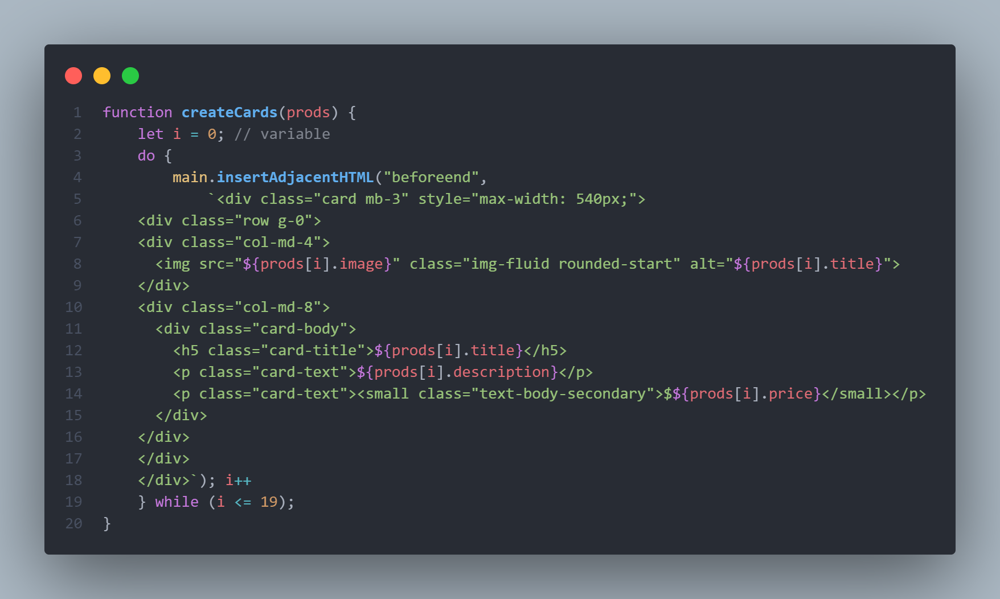

# Products Fake API
---
Práctica Javascript

El fin del ejercicio era poder traer desde [fakestoreapi](https://fakestoreapi.com/products/) un array para poner el práctica el método **fetch()* junto a demás 
elementos dentro de JavaScript.

---

**Con este ejercicio se puso en práctica lo siguiente:**
* Fetch()
* Do While
* .then
* .catch

---
## Disclaimer:

> Se realizó con fines académicos.
---
## License

[MIT](./LICENSE)